# 前端VUE：
    Github地址：https://github.com/wangyinghaotest/VueAutomatedTestPlatform
# TestPlatformDjango
    先添加系统的环境变量 ENV=1 用来区别本地环境以及线上环境
    测试环境：ENV=1
    生产环境：ENV=SERVER

# 根据数据库迁移文件生成对应SQL语句并执行
    python manage.py migrate
# 初次执行时为了先把默认Django需要的数据库创建出来,创建数据库迁移文件
    python manage.py makemigrations
# 启动Django
    python manage.py runserver 0.0.0.0:8081
#项目介绍
#首页
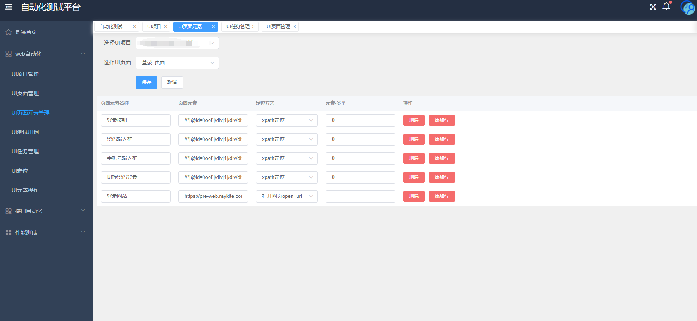

#Web自动化

页面元素管理
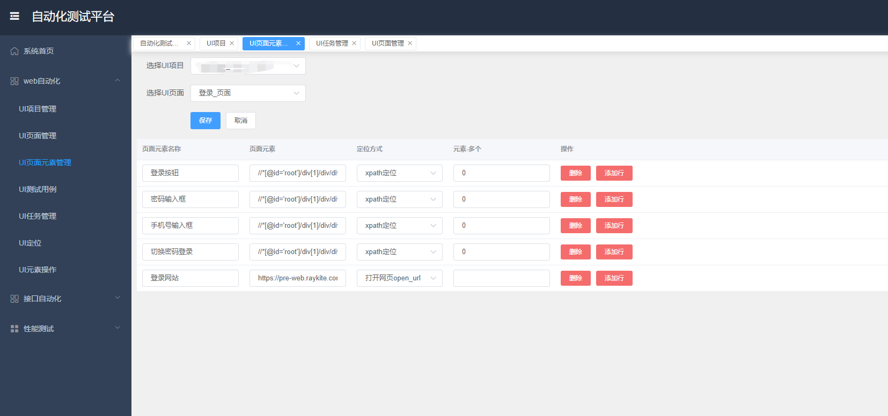

测试报告

测试报告详情
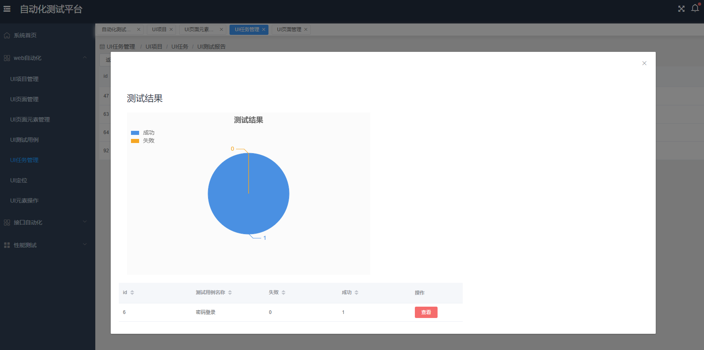

UI定位

UI元素操作
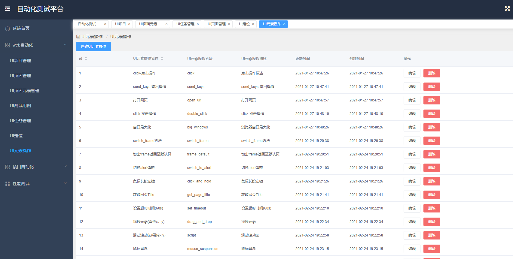

#接口自动化
API测试用例
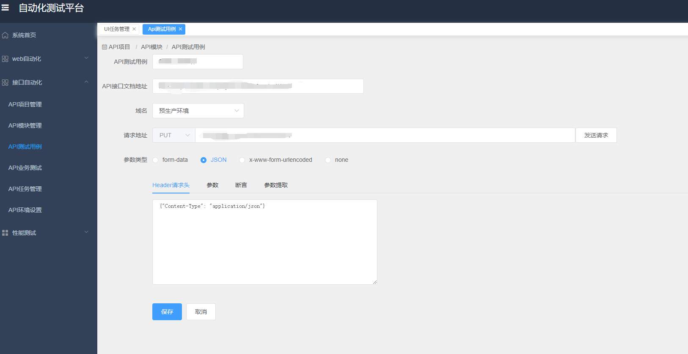

API测试用例-发送请求
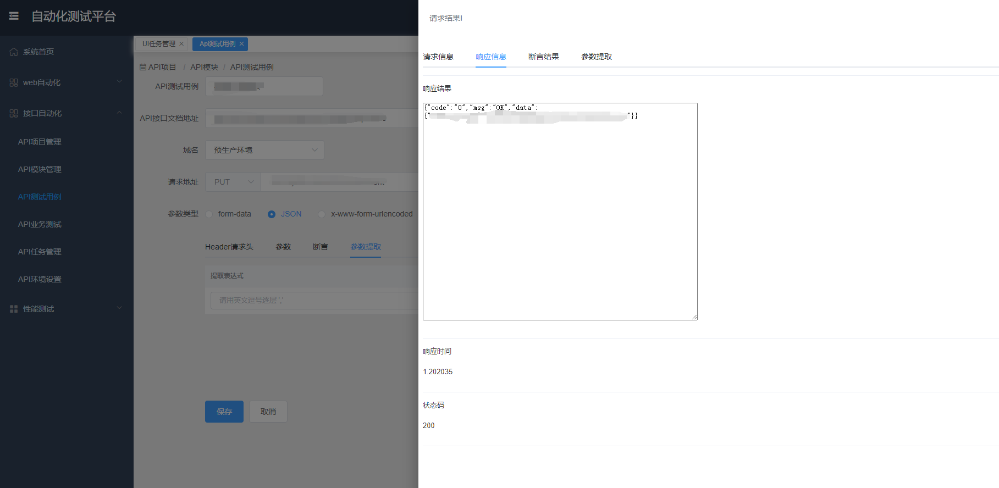

API业务测试用例
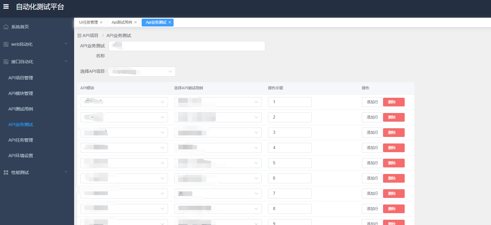

API测试报告
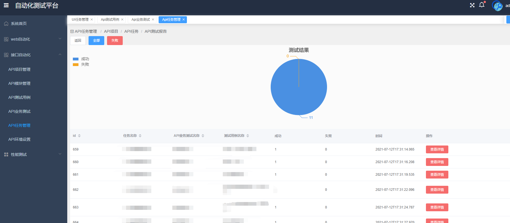

API测试报告详情
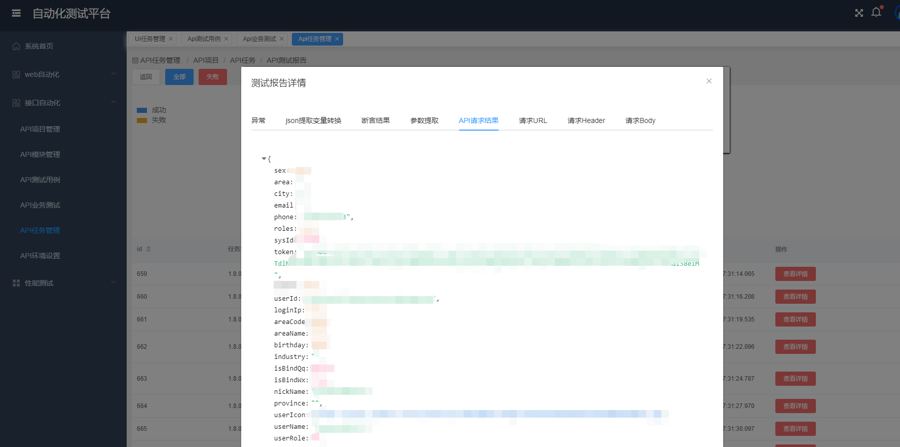

#性能测试
性能测试脚本页面
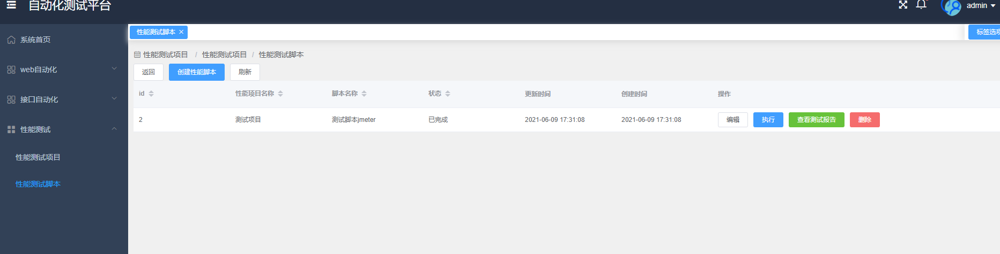

性能测试脚本
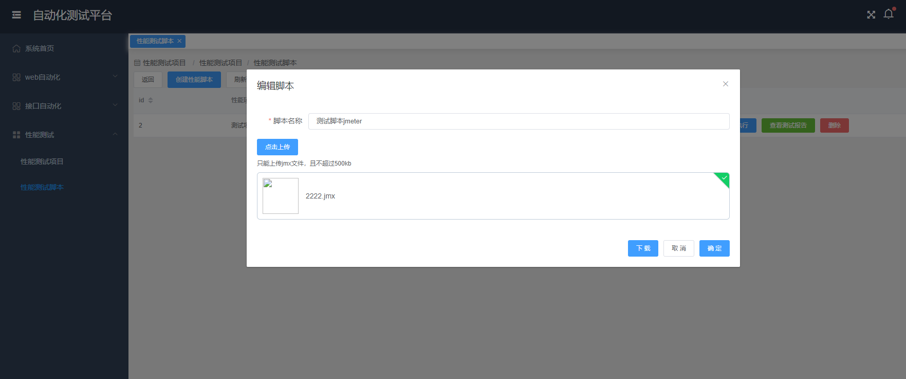
